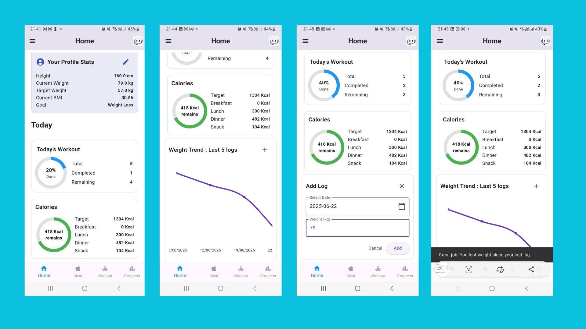
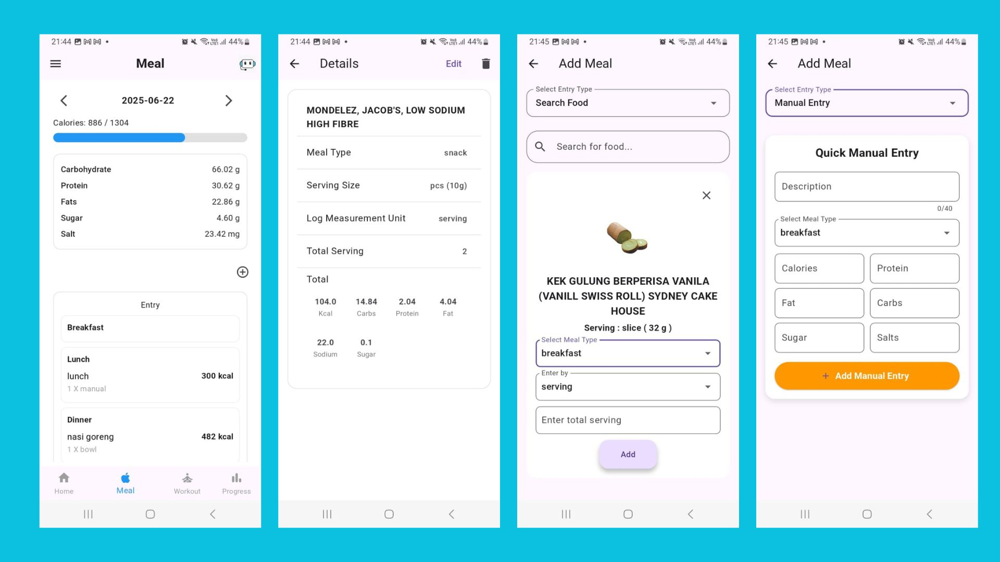
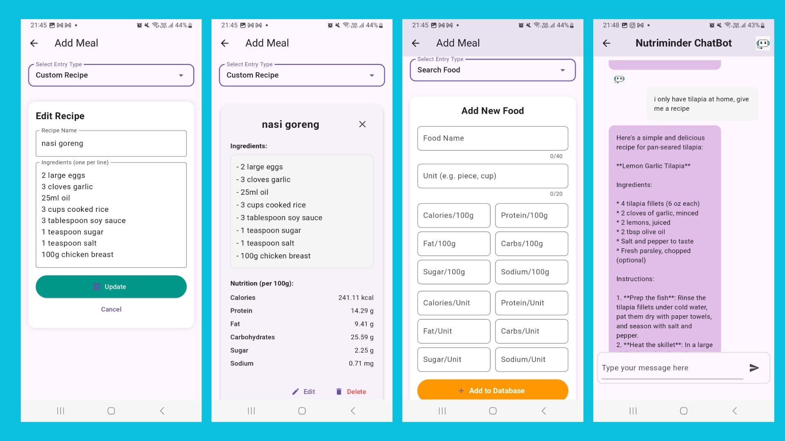
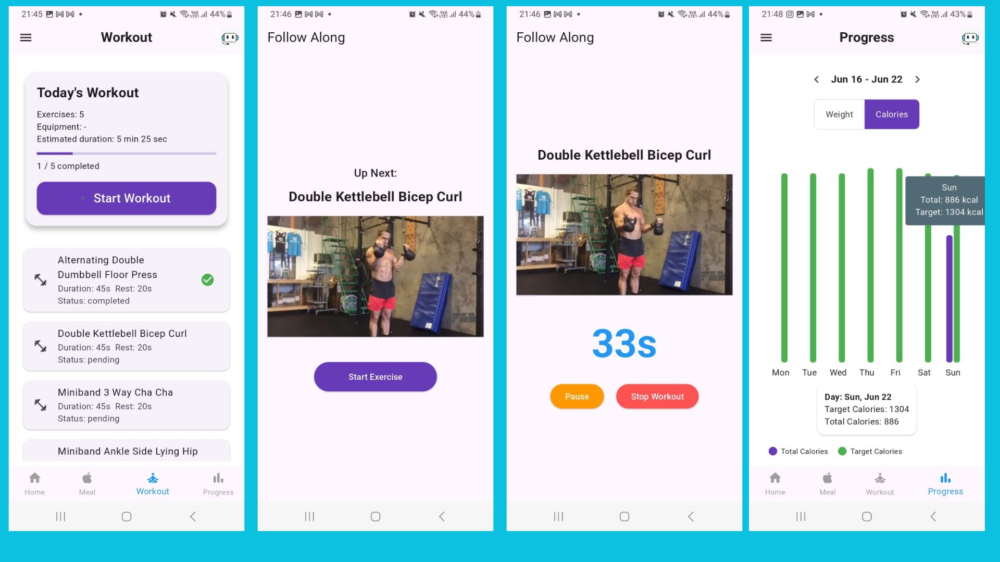

# NutriMinder: AI-Powered Nutrition & Workout Tracker

**NutriMinder** is an AI-powered mobile application built using Django (backend) and Flutter (frontend). It helps users track meals, calories, workouts, and weight trends, with personalized nutrition tips provided by an integrated chatbot.

---

## 🚀 Features

- Daily meal logging (food search, manual entry, custom recipes)
- Calorie and macro tracking
- Interactive weight and calorie trend graphs
- AI-powered nutritional analysis via Groq API
- Chatbot for personalized dietary advice and recipes
- Workout logging and guided follow-along videos
- Demo account for quick app exploration

---

## 📸 Screenshots

| Home & Stats | Meal Logging | Custom Recipe | Workout & Progress |
|--------------|--------------|---------------|--------------------|
|  |  |  |  |

*Screens illustrating home stats, meal logging, custom recipes, chatbot, workouts, and progress.*

---

## 🛠️ Setup Instructions

### Backend (Django)

Set up the Django backend locally:

```bash
cd nutriminder-full/backend

python -m venv venv

# Activate the virtual environment:
# Windows:
venv\Scripts\activate
# MacOS/Linux:
source venv/bin/activate

pip install -r requirements.txt

# Create a .env file (use provided ENV_SAMPLE as reference):
SECRET_KEY=
DATABASE_NAME=
DATABASE_USER=
DATABASE_PASSWORD=
DATABASE_HOST=
DATABASE_PORT=
EMAIL_BACKEND=
EMAIL_HOST=
EMAIL_PORT=
EMAIL_USE_TLS=
EMAIL_HOST_USER=
EMAIL_HOST_PASSWORD=
GROQ_API_TOKEN=

# Apply migrations:
python manage.py migrate

# Insert initial data into table from:
Food_database.txt
Exercise_database.txt

# Run migrations and start the Django server:
python manage.py migrate
python manage.py runserver
# Django server at: http://localhost:8000/
```

### Frontend (Flutter)

Set up the Flutter frontend locally:

```bash
cd ../frontend

flutter pub get

# Create .env from .env.sample and set your backend URL:
API_BASE_URL=http://10.0.2.2:8000

# Launch on device/emulator:
flutter run
```

---

## 🌱 Environment Variables

Both the backend (`backend/.env`) and frontend (`frontend/.env`) require configuration files based on the provided `.env.sample`. Ensure all API tokens, keys, and database credentials are properly filled in.

---

## 📲 How to Try (APK)

Quickly try NutriMinder without setup:

- Download the `.apk` file in the repository 
- Install on an Android device (you may need to enable installations from "Unknown Sources").

---

## 🔑 Demo Account

- **Sign up** with your own email, or use the demo credentials:

```
Username: Demo
Password: Password@123
```

---

## 📬 Contact & Support

For questions, bug reports, or contributions, please open a GitHub issue or reach out via email at [pmaneemay@gmail.com].

---


